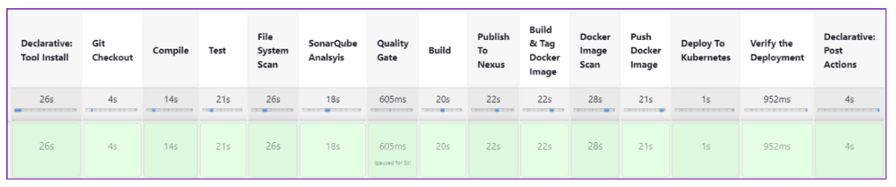

# End-to-End CI/CD Pipeline (Local DevOps Project)

This project demonstrates a complete **production-grade CI/CD pipeline**
implemented on a **local Fedora Linux machine**, without using any cloud services.

The pipeline automates:
- Code build & test
- Static code analysis
- Security scanning
- Artifact versioning
- Docker image creation
- Kubernetes deployment

Architecture Diagram :

Tools Used (precise, no fluff)
## Tech Stack

- OS: Fedora Linux (aws,azure,gcp) if need to do it in cloud
- CI/CD: Jenkins
- SCM: GitHub
- Build Tool: Maven
- Code Quality: SonarQube
- Security Scanning: Trivy
- Artifact Repository: Nexus Repository Manager
- Containerization: Docker
- Orchestration: Kubernetes (kind/minikube)

Why i have choosen to do this my local so that i could understand it easy to with out a cloud if i could mangae to pull this rest of the could is easy to do.

Pipeline Stages
## CI/CD Pipeline Stages

1. Git Checkout
2. Compile Source Code
3. Run Unit Tests
4. File System Vulnerability Scan (Trivy)
5. Static Code Analysis (SonarQube)
6. Quality Gate Enforcement
7. Package Application (Maven)
8. Publish Artifact to Nexus
9. Build Docker Image
10. Docker Image Security Scan
11. Push Image to Docker Registry
12. Deploy Application to Kubernetes
13. Verify Deployment

## Key Highlights

- Fully local CI/CD pipeline (no cloud dependency)
- Production-style quality gates using SonarQube
- Security scanning integrated at multiple stages
- Artifact versioning using Nexus
- Kubernetes-based deployment
- Jenkins pipeline as code (Jenkinsfile)
